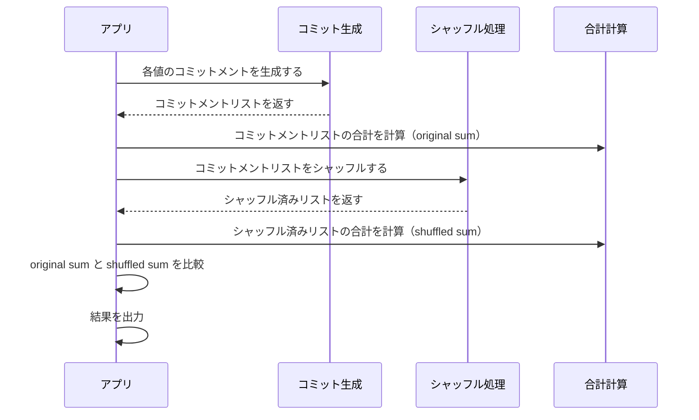
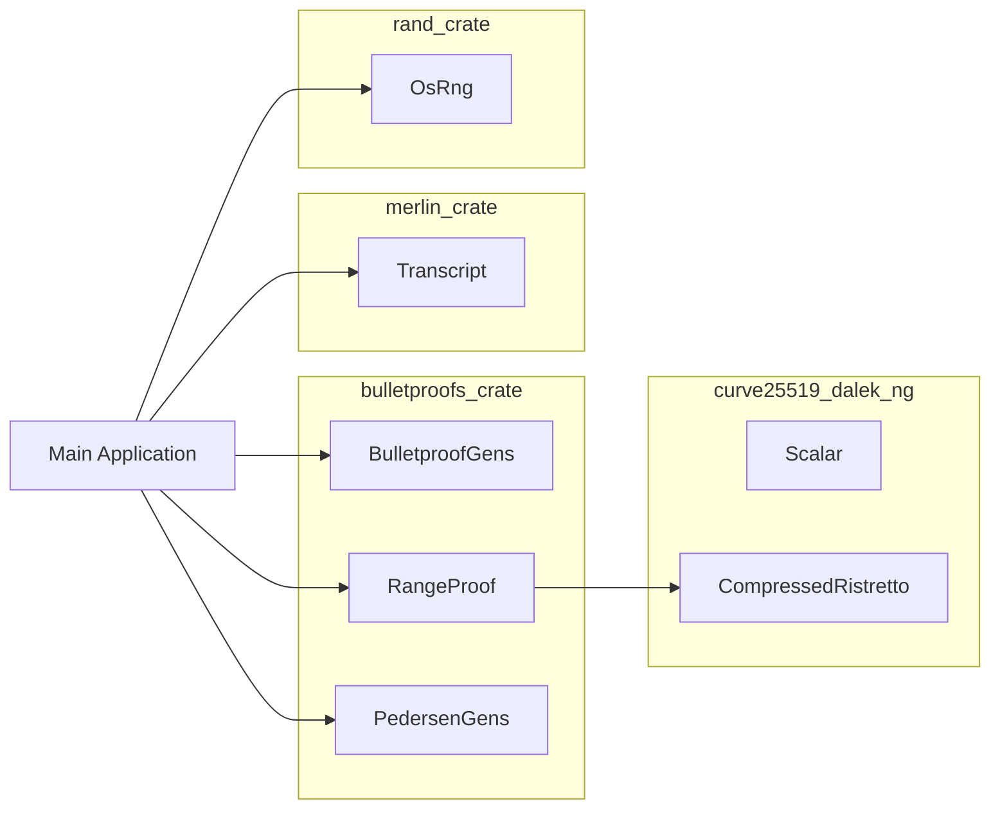
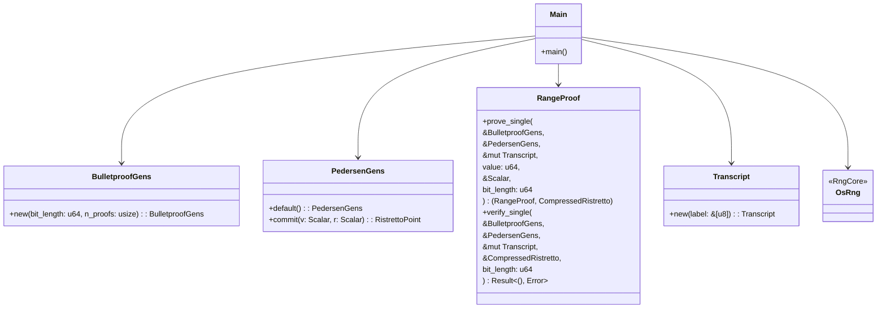
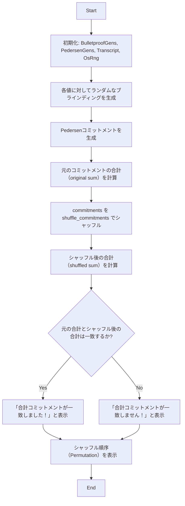
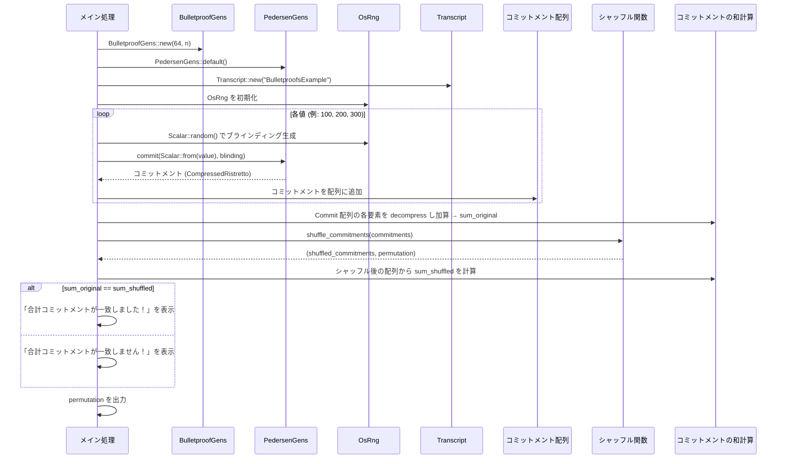

## 概要
複数のペデンコミットメント（各々のレンジプルーフで証明される値のコミットメント）をシャッフルし、シャッフル前後で合計が同じであること（準同型性）を確認するコード
※ 実際の「検証可能なシャッフル（verifiable shuffle）」は、出力が入力の順序変更であることをゼロ知識証明で示す必要がありますが、ここでは基本的なシャッフル処理とその準同型性の確認を行うサンプルコードとして示しています。


### 処理

1. **コミットメントの生成**  
   - 各値に対して、ランダムなブラインディング \(r\) を用いてペデンコミットメント  
     \( C = rH + vG \)  
     を作成しています。

2. **シャッフル処理**  
   - `shuffle_commitments` 関数で、コミットメントの配列をランダムに並び替え、そのときの順序（Permutation）も返します。

3. **準同型性の確認**  
   - ペデンコミットメントは加法的であるため、入力の全コミットメントの和と、シャッフル後の全コミットメントの和は一致するはずです。  
   - このサンプルでは、両者の合計を計算し、一致するかどうかを確認しています。

---
## 簡易的シーケンス図




1. **コミット生成**  
   - アプリが各値のコミットメントを生成し、コミットメントリストを作成します。

2. **合計計算（シャッフル前）**  
   - 生成されたコミットメントリストの和（original sum）を計算します。

3. **シャッフル処理**  
   - コミットメントリストをランダムに並び替え、シャッフル済みリストを得ます。

4. **合計計算（シャッフル後）**  
   - シャッフル済みリストの和（shuffled sum）を計算します。

5. **検証と結果出力**  
   - シャッフル前後の和が一致するかを比較し、結果を出力します。

---


### シャッフラーとして活かすには

実際のシャッフラーとして利用する場合、  
- 各参加者は自身の入力コミットメントとレンジプルーフを提出し、  
- シャッフラーはこれらをランダムに並び替えた上で、並び替えが正しく行われた（つまり、全体の合計が保存されている）ことを追加の証明（例：ゼロ知識のシャッフル証明）で示す必要があります。

このサンプルはその基礎となる処理（並び替えと加法的性質の確認）を示すものです。実用システムでは、並び替え証明のための追加のゼロ知識プロトコル（たとえば、Verifiable Shuffle のプロトコル）を組み合わせることで、参加者に対してシャッフラーが不正な並び替えをしていないことを保証することが可能です。


---

### 1. アーキテクチャ図  
各主要コンポーネント（Bulletproofs、curve25519‑dalek‑ng、Merlin、rand）と Main アプリケーションとの関係を示しています。



---

### 2. クラス仕様図  
主要な構造体とその関数を示すクラス図の例です。



※ ※ クレート内部の型（Scalar や CompressedRistretto）は、それぞれ curve25519‑dalek‑ng 内で定義されています。

---

### 3. 処理フロー図  
コード内での主要な処理の流れを示すフローチャート例です。



---

## シーケンス図（詳細）



---

### 説明

1. **初期化フェーズ**  
   - `BulletproofGens`、`PedersenGens`、`Transcript`、`OsRng` をそれぞれ初期化します。

2. **コミットメント生成**  
   - 各取引（値）に対して、乱数からブラインディング係数を生成し、`PedersenGens` を使ってペデンコミットメントを作成します。生成したコミットメントは配列に格納されます。

3. **合計の計算**  
   - 生成された全コミットメントの加法的性質（準同型性）を利用して、元の（シャッフル前）全体の和を計算します。

4. **シャッフル処理**  
   - コミットメント配列をランダムに並び替え、並び替えの順序（Permutation）も返します。

5. **シャッフル後の合計計算と検証**  
   - シャッフル後の配列から再度全体の和を計算し、元の和と一致するかどうかを比較します。準同型性により、並び替え前後で合計は変わらないはずです。

6. **結果の出力**  
   - 合計が一致すれば正しいシャッフルとして検証成功、さらに適用された並び替え順序も出力します。


## 実行方法
```bash
curl --proto '=https' --tlsv1.2 -sSf https://sh.rustup.rs | sh
cargo install bulletproofs curve25519-dalek-ng merlin rand serde serde_json blake3 hex
cd bulletproofs_example
cargo build --release
cp target/release/shuffle_verifier ../
```