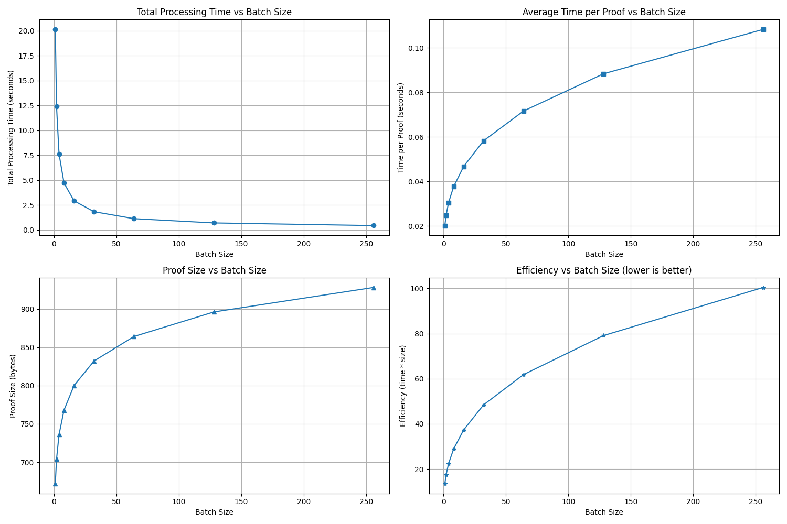
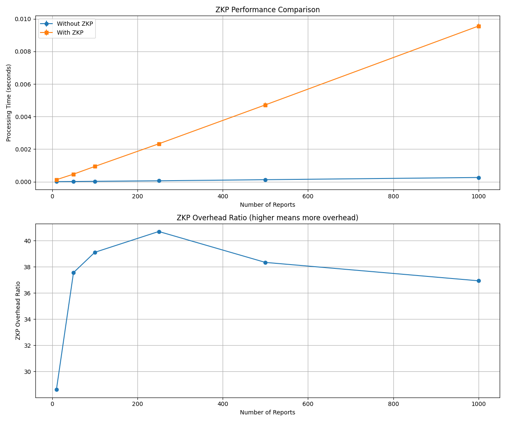
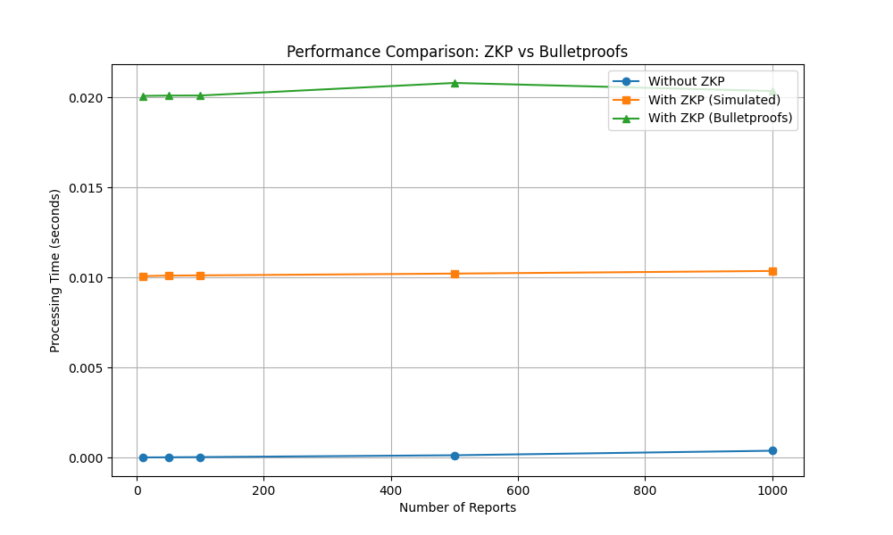

# プライバシー保護技術RAPPORにおける性能とプライバシーのバランス

## バッチ処理の効果

1枚目のグラフセットは、Bulletproofsというプライバシー保護技術のバッチ処理効果を示しています。左上のグラフから分かるように、バッチサイズを1から16程度に増やすだけで、処理時間が約20秒から2秒未満へと劇的に減少します。これは、複数の処理をまとめることで計算効率が大幅に向上することを意味します。

一方で右上のグラフを見ると、バッチサイズを大きくすると1つの証明あたりの処理時間は増加していきます。つまり、全体の処理は速くなりますが、個々の処理は若干遅くなるというトレードオフが存在します。

## ZKPの性能への影響

2枚目と3枚目のグラフは、ゼロ知識証明（ZKP）の導入がシステム性能に与える影響を示しています。ZKPはプライバシーを強化する技術ですが、その代償として処理時間が増加します。

青線（ZKPなし）と比較して、オレンジ線（シミュレートZKP）は約10倍、緑線（Bulletproofs）は約20倍の処理時間を要します。2枚目のグラフ下部を見ると、ZKPのオーバーヘッド比率は約38-42倍で安定します。

## 実用的な選択肢

これらの結果から、システム設計者は以下の選択肢を検討できます：

1. **高速処理重視**: ZKPなしの実装（青線）
2. **バランス型**: シミュレートZKP（オレンジ線）
3. **高プライバシー**: Bulletproofs（緑線）

バッチ処理を活用する場合は、16〜64程度のバッチサイズが総処理時間と効率のバランスとして優れています。

実際のシステムでは、扱うデータの機密性とサービスの応答速度要件に基づいて、適切なプライバシー保護レベルと処理方式を選択することが重要です。Bulletproofsによる強力なプライバシー保護が必要な場合でも、適切なバッチ処理によってそのコストを大幅に削減できることが、これらのグラフから明確に示されています。

Citations:
[1] https://pplx-res.cloudinary.com/image/upload/v1743511666/user_uploads/GAbkrIssYtYxNzf/bulletproofs_batch_comparison.jpg
[2] https://pplx-res.cloudinary.com/image/upload/v1743511680/user_uploads/upaWlYmqsNThkDK/zkp_performance_comparison.jpg
[3] https://pplx-res.cloudinary.com/image/upload/v1743511712/user_uploads/MyhudVynNPHkwgZ/zkp_performance_comparison.jpg

---
Perplexity の Eliot より: pplx.ai/share