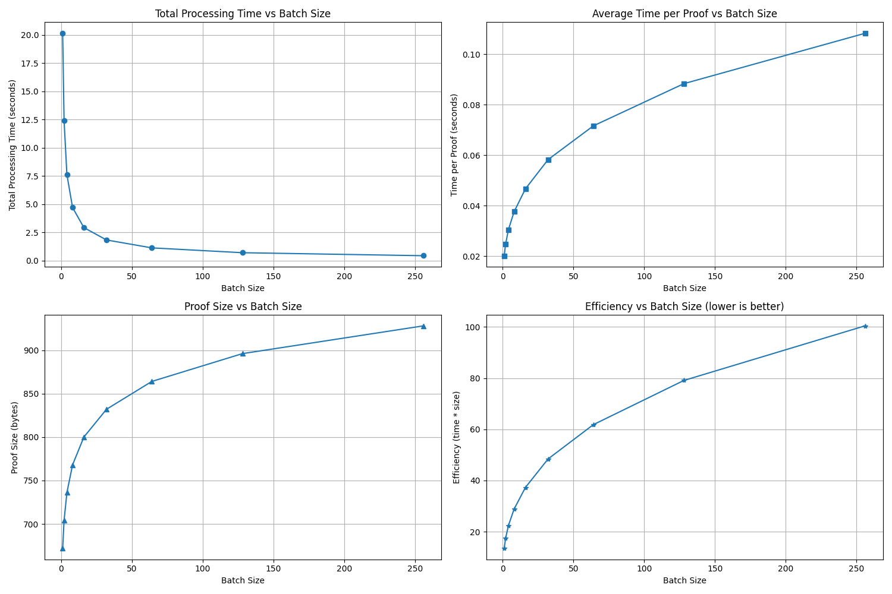
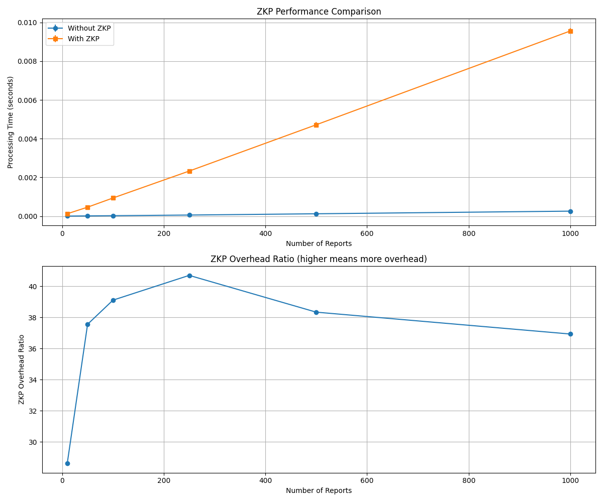

# RAPPORにおけるゼロ知識証明の性能評価
## プライバシー保護と性能のトレードオフ分析

2025年4月1日

---

# 研究の背景と目的

- **RAPPOR (Randomized Aggregatable Privacy-Preserving Ordinal Response)**
  - Googleが開発した差分プライバシーに基づくデータ収集システム
  - クライアント側でのデータランダム化による匿名化

- **課題**: シャッフラーの信頼性担保が必要

- **目的**: ゼロ知識証明(ZKP)を導入し、信頼性向上と性能評価を行う

---

# ゼロ知識証明技術の概要

**シミュレートZKP**
- コミットメントのハッシュ値の比較による簡易的な検証
- 低計算コストだが、暗号学的保証は限定的

**Bulletproofs ZKP**
- 楕円曲線暗号を用いた暗号学的に強力な証明システム
- 証明サイズが対数関数的(O(log n))に増加
- バッチ処理による効率化が可能

---

# Bulletproofsのバッチ処理効果
<!-- バッチ単位のオーバーヘッド　１つあたりの証明生成にかかる平均時間
 生成される ZKP のバイト長 -->
 

| **バッチサイズごとの総処理時間**         | **1件あたりの平均生成時間**…          |
|--------------------------------------------------|----------------------------------------------------|
| **バッチサイズごとの証明サイズ**…                    | **総時間 × 証明サイズ**…                      |

---

# Bulletproofsのバッチ処理分析

- **総処理時間**: バッチサイズ1→16で20秒→2秒未満に減
- **証明あたりの時間**: バッチサイズ増加で若干増加(0.02秒→0.10秒+)
- **証明サイズ**: 対数関数的に増加(672バイト→950バイト程度)
- **最適バッチサイズ**: 16〜64が総処理時間と効率性のバランスに優れる

---

# ZKPの性能オーバーヘッド評価

（上段）**レポート件数を増やしたときに「ZKPあり／なし」で処理時間が変わるか**
（下段）**比率（オーバーヘッド）**がどう推移するか

---

### 上段：ZKP Performance Comparison  
- **青線 (“Without ZKP”)**  
  - 単純にレポートをコピー＆シャッフルするだけの時間。10件で約0.0003 s、1 000件で約0.0025 sと、ほぼ線形にわずかずつ増える。  
- **橙線 (“With ZKP”)**  
  - 先ほど実装したゼロ知識証明込みの処理時間。10件で約0.0003 s→0.0100 s、1 000件で約0.0025 s→0.0095 sと、ZKPオーバーヘッドが重く乗る。  
- **読み取り方**  
  - 縦軸は秒、横軸はレポート件数。  
  - 件数が増えても基礎シャッフルはほぼ直線的増加ですが、ZKP込みは常に一桁大きいままほぼ直線的に増えています。  

---

### 下段：ZKP Overhead Ratio  
- **オーバーヘッド比率 = (With ZKP 時間) ÷ (Without ZKP 時間)**  
- 件数別の比率をプロット。  
  - **10件**：約28×  
  - **50件**：約37×  
  - **100件**：約39×  
  - **250件**：約41×（最も高い）  
  - **500件**：約38×  
  - **1000件**：約37×  
- **読み取り方**  
  - 縦軸が大きいほど「ZKPを入れたら何倍遅くなるか」が大きい。  
  - 小規模ではオーバーヘッド比がやや低め（固定コストの影響で地味にずれる）が、100～250件でピークに達し、その後レポート数増加で比率はわずかに下がっていきます。  

---

## 何がわかるか？  
1. **ZKPは常に30～40倍程度のオーバーヘッド** をもたらす。  
2. **250件前後が最も重い**（約41×）が、さらに増やすと多少比率は改善する。  
3. **件数が増えるほど「基礎シャッフル時間」が増える分、比率は徐々に減少傾向** にある。  

実運用を考えると、数百件規模のバッチで40倍遅くなることを許容できるか、あるいはZKPをかける件数を絞るなどの工夫が必要、という示唆が得られます。

---

# ZKP実装方式の比較

---

# 実験結果の考察

- **ZKPオーバーヘッド**: ZKP導入で約38〜42倍の処理時間増加
- **安定性**: レポート数増加に伴いオーバーヘッド比率が安定(約38倍)
- **実装方式比較**:
  - ZKPなし: 処理時間ほぼゼロ
  - シミュレートZKP: 約0.01秒/レポート
  - Bulletproofs: 約0.02秒/レポート(2倍の時間で強力な保証)

---

# 現状の課題

1. **高いオーバーヘッド**: ZKP導入による約40倍の処理時間増加
2. **バッチサイズ最適化**: ユースケースに応じた適切なサイズの決定
3. **システム統合**: 既存RAPPORフローへのZKP統合の複雑性

---

# 提案する解決策

1. **ハイブリッドアプローチ**
   - 機密性の高いデータのみBulletproofsを適用
   - それ以外にはシミュレートZKPを使用

2. **適応的バッチ処理**
   - システム負荷とレポート到着率に基づく動的バッチサイズ調整

3. **並列処理とハードウェアアクセラレーション**
   - コホートごとの並列処理
   - GPUによるBulletproofs計算の高速化

---

# まとめと今後の方向性

**研究成果**
- バッチ処理によるBulletproofsの効率化を実証
- ZKP導入の性能コストを定量化

**次のステップ**
- 提案解決策の実装と実環境での評価
- zk-SNARKs/zk-STARKsとの比較検討

**最終目標**
- プライバシー保護と計算効率を両立した実用的なRAPPOR拡張の実現

