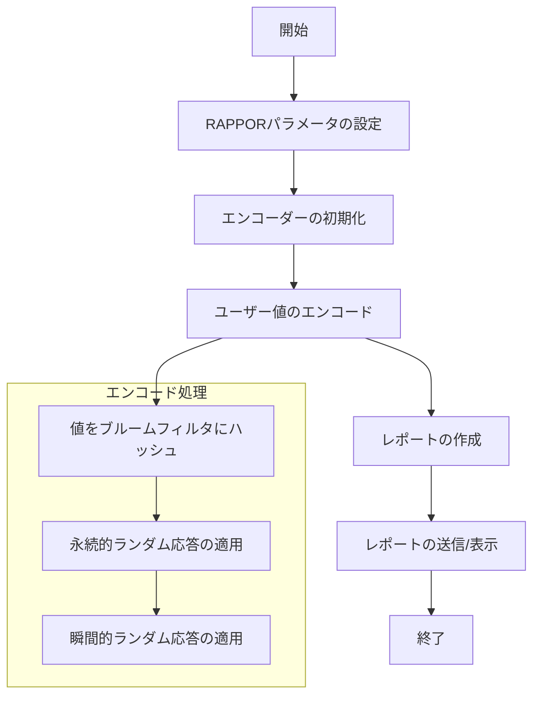
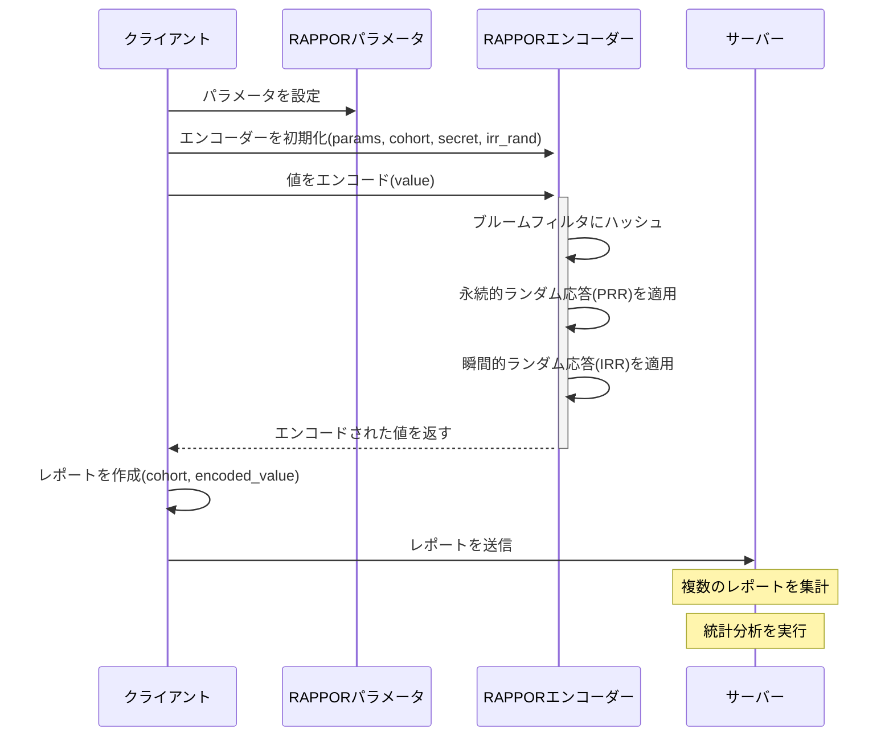
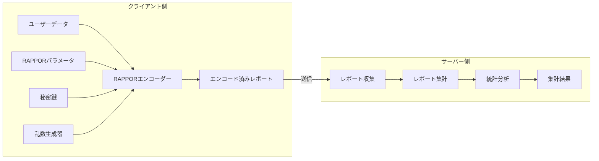
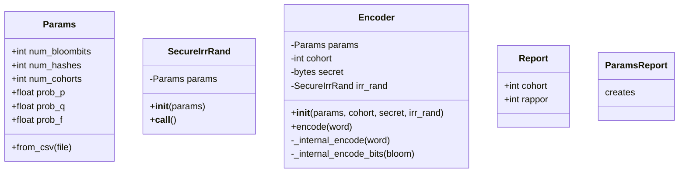

# RAPPORを使用したプライバシー保護データ収集コードの解説

以下に、正常に動作するようになったRAPPORクライアントコード（`client0.py`）の各部分の詳細な解説を提供します。

```python
import rappor  # rappor.pyをインポート

# RAPPORパラメータの設定
params_obj = rappor.Params()
params_obj.num_cohorts = 64      # コホート数
params_obj.num_hashes = 2        # ハッシュ関数数
params_obj.num_bloombits = 16    # ブルームフィルタのビット数
params_obj.prob_p = 0.5          # 永続的ランダム応答の確率
params_obj.prob_q = 0.75         # 瞬間的ランダム応答の確率
params_obj.prob_f = 0.5          # 偽陽性率

# エンコーダーの初期化
cohort = 0  # または適切なコホート番号
secret = "secret_key".encode('utf-8')  # 文字列をUTF-8でエンコードしてバイト型に変換
irr_rand = rappor.SecureIrrRand(params_obj)
encoder = rappor.Encoder(params_obj, cohort, secret, irr_rand)

# ユーザーの値をエンコード
value = "value_to_encode".encode('utf-8')  # 文字列をバイト列にエンコード
encoded_value = encoder.encode(value)  # これだけで完了します

# サーバーに送信するデータ
report = {
    'cohort': cohort,
    'rappor': encoded_value
}

# レポートの表示（確認用）
print("Report:", report)
```

## 1. RAPPORパラメータの設定

```python
params_obj = rappor.Params()
params_obj.num_cohorts = 64      # コホート数
params_obj.num_hashes = 2        # ハッシュ関数数
params_obj.num_bloombits = 16    # ブルームフィルタのビット数
params_obj.prob_p = 0.5          # 永続的ランダム応答の確率
params_obj.prob_q = 0.75         # 瞬間的ランダム応答の確率
params_obj.prob_f = 0.5          # 偽陽性率
```

この部分では、RAPPORのプライバシーパラメータを設定しています：

- **num_cohorts (64)**: ユーザーを分類するコホートの数。コホートによってハッシュ関数が異なるため、同じ値でも異なるビットパターンになります。
- **num_hashes (2)**: ブルームフィルタで使用するハッシュ関数の数。値が大きいほど偽陽性率が下がりますが、プライバシー保護が弱まる可能性があります。
- **num_bloombits (16)**: ブルームフィルタのビット数。値が大きいほど多くの一意の値を区別できますが、プライバシーコストが高くなります。
- **prob_p (0.5)**: 永続的ランダム応答（PRR）で「1」を保持する確率。
- **prob_q (0.75)**: 永続的ランダム応答（PRR）で「0」を「1」に変える確率。
- **prob_f (0.5)**: 瞬間的ランダム応答（IRR）でビットをランダム化する確率。

これらのパラメータは、プライバシー保護の強度と統計的有用性のバランスを決定します。

## 2. エンコーダーの初期化

```python
cohort = 0  # または適切なコホート番号
secret = "secret_key".encode('utf-8')  # 文字列をUTF-8でエンコードしてバイト型に変換
irr_rand = rappor.SecureIrrRand(params_obj)
encoder = rappor.Encoder(params_obj, cohort, secret, irr_rand)
```

この部分では、RAPPORエンコーダーを初期化しています：

- **cohort (0)**: ユーザーが属するコホート番号（0〜num_cohorts-1の範囲）。
- **secret**: PRRを決定論的にするための秘密鍵。Python 3ではバイト型が必要なため、UTF-8でエンコードしています。
- **irr_rand**: 瞬間的ランダム応答（IRR）に使用するランダム性インターフェース。`SecureIrrRand`は暗号学的に安全な乱数生成器を使用します。
- **encoder**: 上記のパラメータを使用してRAPPORエンコーダーを初期化します。

## 3. 値のエンコード

```python
value = "value_to_encode".encode('utf-8')  # 文字列をバイト列にエンコード
encoded_value = encoder.encode(value)  # これだけで完了します
```

この部分では、実際のデータをエンコードしています：

- **value**: エンコードする値。Python 3ではバイト型が必要なため、UTF-8でエンコードしています。
- **encoded_value**: RAPPORアルゴリズムによってエンコードされた値。

`encode`メソッドは内部で以下の3つのステップを実行します：
1. **ブルームフィルタへのハッシュ**: 値をブルームフィルタにハッシュします（コホートに基づいて異なるハッシュ関数を使用）。
2. **永続的ランダム応答（PRR）**: ブルームフィルタのビットを確率的に反転させて、長期的なプライバシーを保護します。
3. **瞬間的ランダム応答（IRR）**: 追加のランダム化を適用して、短期的なプライバシーを保護します。

## 4. レポートの作成と送信

```python
report = {
    'cohort': cohort,
    'rappor': encoded_value
}

print("Report:", report)
```

この部分では、エンコードされた値とコホート情報を含むレポートを作成しています：

- **cohort**: ユーザーのコホート番号（サーバー側でデコードに必要）。
- **rappor**: エンコードされた値（プライバシーが保護された形式）。

実際のシステムでは、このレポートをサーバーに送信し、サーバー側で集計・分析を行います。

## RAPPORの仕組みと利点

RAPPORは以下の特徴を持つプライバシー保護技術です：

1. **ローカル差分プライバシー**: 各ユーザーのデータは送信前にクライアント側でランダム化されるため、サーバーは個々のユーザーの実際の値を知ることができません。

2. **長期的プライバシー保護**: 永続的ランダム応答（PRR）により、同じ値が常に同じエンコード結果にならないようにします。

3. **短期的プライバシー保護**: 瞬間的ランダム応答（IRR）により、同じPRR値が異なるレポートになるようにします。

4. **コホートベースのハッシュ**: ユーザーを複数のコホートに分割し、各コホートで異なるハッシュ関数を使用することで、プライバシーをさらに強化します。

このコードは、RAPPORの基本的な実装例であり、実際のシステムではさらに多くの機能（エラー処理、複数値の処理、サーバー側の分析など）が必要になる場合があります。
以下に、RAPPORを使用したプライバシー保護データ収集コードの各種図を示します。

## 処理フロー図（Flowchart）



## シーケンス図（Sequence Diagram）



## アーキテクチャ図（Architecture Diagram）



## クラス仕様図（Class Diagram）



## 詳細な説明

### 処理フロー図
処理フロー図は、RAPPORを使用したデータ収集の全体的な流れを示しています。まずパラメータを設定し、エンコーダーを初期化した後、ユーザーの値をエンコードしてレポートを作成します。エンコード処理は、ブルームフィルタへのハッシュ、永続的ランダム応答、瞬間的ランダム応答の3つのステップで構成されています。

### シーケンス図
シーケンス図は、クライアント、エンコーダー、サーバー間の相互作用を時系列で示しています。クライアントがエンコーダーを初期化し、値をエンコードした後、レポートをサーバーに送信します。エンコード処理の内部ステップも示されています。

### アーキテクチャ図
アーキテクチャ図は、システム全体の構成要素とその関係を示しています。クライアント側ではユーザーデータがRAPPORエンコーダーによって処理され、サーバー側では収集されたレポートが集計・分析されます。

### クラス仕様図
クラス仕様図は、RAPPORの主要なクラスとその関係を示しています。`Params`クラスはRAPPORのパラメータを保持し、`SecureIrrRand`クラスは乱数生成を担当します。`Encoder`クラスはこれらを使用して値をエンコードし、`Report`クラスはエンコードされた値とコホート情報を含むレポートを表します。

これらの図を通じて、RAPPORを使用したプライバシー保護データ収集システムの全体像と詳細な動作を理解することができます。