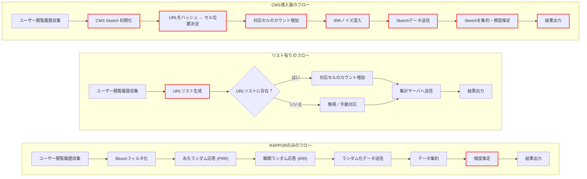
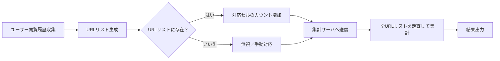
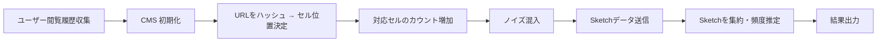
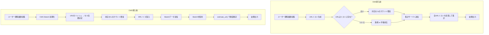
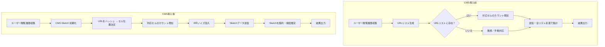

**CMS導入前RAPPORのみのフロー**

```mermaid
flowchart LR

  %%─── RAPPORのみのフロー ───
  subgraph RAPPORのみのフロー
    direction LR
    A1["ユーザー閲覧履歴収集"] --> B1["Bloomフィルタ化"]
    B1 --> C1["永久ランダム応答 (PRR)"]
    C1 --> D1["瞬間ランダム応答 (IRR)"]
    D1 --> E1["ランダム化データ送信"]
    E1 --> F1["データ集約"]
    F1 --> G1["頻度推定"] 
    G1 --> H1["結果出力"]
  end

  %%─── リスト有りのフロー ───
  subgraph リスト有りのフロー
    direction LR
    A2["ユーザー閲覧履歴収集"] --> B2["URLリスト生成"]
    B2 --> C2{"URLリストに存在？"}
    C2 -->|はい| D2["対応セルのカウント増加"]
    C2 -->|いいえ| E2["無視／手動対応"]
    D2 --> F2["集計サーバへ送信"]
    E2 --> F2
    F2 --> G2["結果出力"]
  end

  %%─── CMS導入後のフロー ───
  subgraph CMS導入後のフロー
    direction LR
    A3["ユーザー閲覧履歴収集"] --> B3["CMS Sketch 初期化"]
    B3 --> C3["URLをハッシュ → セル位置決定"]
    C3 --> D3["対応セルのカウント増加"]
    D3 --> E3["IRRノイズ混入"]
    E3 --> F3["Sketchデータ送信"]
    F3 --> G3["Sketchを集約・頻度推定"]
    G3 --> H3["結果出力"]
  end

  %%─── 強調設定 ───
  classDef warn stroke:red,stroke-width:2px;
  classDef highlight stroke:red,stroke-width:2px;

  %% RAPPORのみ：G1 を赤枠で強調
  class G1 warn;

  %% リスト生成困難：B2 を赤枠で強調
  class B2 warn;

  %% CMS導入後の新規ステップを赤枠で強調
  class B3,C3,D3,E3,F3,G3,H3 highlight;
```

**リスト有りのときのフロー**

```mermaid
flowchart LR
  direction LR
  A[ユーザー閲覧履歴収集] --> B[URLリスト生成]
  B --> C{URLリストに存在？}
  C -->|はい| D[対応セルのカウント増加]
  C -->|いいえ| E[無視／手動対応]
  D --> F[集計サーバへ送信]
  E --> F
  F --> G[全URLリストを走査して集計]
  G --> H[結果出力]
```

---

**CMS導入後のフロー**

```mermaid
flowchart LR
  direction LR
  A[ユーザー閲覧履歴収集] --> B[CMS 初期化]
  B --> C[URLをハッシュ → セル位置決定]
  C --> D[対応セルのカウント増加]
  D --> E[ノイズ混入]
  E --> F[Sketchデータ送信]
  F --> G[Sketchを集約・頻度推定]
  G --> H[結果出力]
```

```mermaid
flowchart TD
  subgraph CMS導入前
    A[ユーザー閲覧履歴収集] --> B[URLリスト生成]
    B --> C{URLはリストに存在？}
    C -->|はい| D[対応セルのカウント増加]
    C -->|いいえ| E[無視 or 手動対応]
    D --> F[集計サーバへ送信]
    E --> F
    F --> G[全URLリストを走査して集計]
    G --> H[結果出力]
  end

  subgraph CMS導入後
    A2[ユーザー閲覧履歴収集] --> B2[CMS Sketch 初期化]
    B2 --> C2[URLをハッシュ → セル位置決定]
    C2 --> D2[対応セルのカウント増加]
    D2 --> E2[IRRノイズ混入]
    E2 --> F2[Sketchデータ送信]
    F2 --> G2[Sketchを集約]
    G2 --> H2["estimate_url() で頻度推定"]
    H2 --> I2["結果出力"]
  end
```

```mermaid
flowchart TB
  subgraph CMS導入前
    direction LR
    A1[ユーザー閲覧履歴収集] --> B1[URLリスト生成]
    B1 --> C1{URLリストに存在？}
    C1 -->|はい| D1[対応セルのカウント増加]
    C1 -->|いいえ| E1[無視／手動対応]
    D1 --> F1[送信・全リスト走査で集計]
    E1 --> F1
    F1 --> G1[結果出力]
  end

  subgraph CMS導入後
    direction LR
    A2[ユーザー閲覧履歴収集] --> B2["CMS Sketch 初期化"]
    B2 --> C2["URLをハッシュ → セル位置決定"]
    C2 --> D2[対応セルのカウント増加]
    D2 --> E2["IRRノイズ混入"]
    E2 --> F2["Sketchデータ送信"]
    F2 --> G2["Sketchを集約・頻度推定"]
    G2 --> H2[結果出力]
  end
```