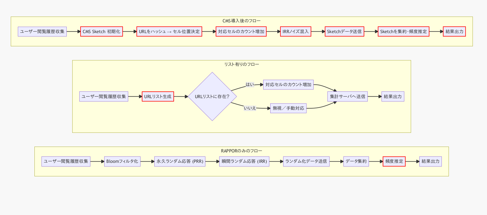

# **背景**
* **問題点**：RAPPORではあらかじめ全URLを辞書化しておく必要があるが、ウェブ上のURLは無数に存在しリスト化は不可能。
1. 入力文字列を複数のハッシュ関数で Bloom フィルタにマッピング
2. フィルタに対して永続的ランダム化（Permanent Randomized Response; PRR）
3. 報告ごとに即時ランダム化（Instantaneous Randomized Response; IRR）
4. サーバー側で多数の報告を集約し、候補文字列集合（辞書）を用いてビットパターンを逆引きし頻度を推定
---
## **提案手法**：Count–Min Sketch（行×列の小さな表）でURLごとにインクリメントし、送信前にランダム応答（IRR）でノイズを混ぜる。
## **利点**：大規模なURL候補リスト不要で、サーバー側ではSketchから任意のURLの訪問頻度を近似推定できる。

---

 # **Count-Min Sketch (CMS)** の数理的仕組み 
 
‐ *N* = ストリーム総件数 
‐ *ε* = 許容相対誤差 
‐ *δ* = 失敗確率 

---

## 1  データ構造

| 深さ | 行数 *d* | 
| -- | ------ | 
| 幅  | 列数 *w* | 

*d × w* の整数表を持ち、各行に独立ハッシュを 1 個だけ割り当てます。([dimacs.rutgers.edu][1], [dsf.berkeley.edu][2])

---

## 2  更新

要素 $x$ が到来したら、すべての行 $i$ について

$$
j = h_i(x),\quad C[i,j]\;\mathrel{+}=1
$$


を実行します（計 *d* 回）。操作は O(*d*) 時間、メモリは O(*w d*)。([barnasaha.net][3])

---

## 3  点クエリ（頻度推定）


頻度推定は要素 $x$ の頻度推定 $\tilde a_x$ は、該当セルの最小値を取る：

$$
\tilde a_x \;=\;\min_{1\le i\le d} C[i,\,h_i(x)].
$$

簡単に言うと
```
min_{行} 表[行, ハッシュ(要素)]
```

—つまり *d* 個の値の最小を返すだけ
→真値を下回らない──衝突はカウントを上乗せする方向にしか働かず、下方向には働かない


---
<!-- 
## 4  誤差保証

$$
\Pr\bigl[\text{推定} \le \text{真値} + εN \bigr] \ge 1-δ.
$$

理由（概略）

1. 1 行での余計な上乗せの期待値は $N/w ≈ εN/e$。
2. マルコフ不等式で「誤差 > εN」の確率を ≤ 1/e に抑制。
3. 行を *d* = ln(1/δ) 回独立に取り、全行で失敗しない確率を $(1-1/e)^d \ge 1-δ$ とする。([dimacs.rutgers.edu][1], [dsf.berkeley.edu][2])


## パラメータ設計例

* 例：ε = 0.01, δ = 0.001
  ⇒ *w* ≈ 272, *d* ≈ 7,
  表サイズ 1.9 k カウンタで 99.9 % の確率で ±1 % 誤差以内。([barnasaha.net][3])

--- -->

<!-- ## 6  拡張の示唆（名称のみ）

* 保守的インクリメント（Conservative Update）で誤差縮小 ([サイエンスダイレクト][4])
* スケッチ同士を足し合わせ可能（線形性）([dimacs.rutgers.edu][1])

--- -->


# Count–Min Sketch（CMS）具体例
以下では、具体的な数値例を使って Count–Min Sketch（CMS）がどのように動作するかをステップごとに示します。


CMS 
①固定サイズの行列（カウンタ）と複数のハッシュ関数を使い、
②ストリーム上の要素を分散してインクリメントし、
③「最小値」を取ることで要素の頻度を推定します。これにより、正確な頻度を数えるには大きなメモリが必要な場合でも、限られたメモリで高速に「およその回数」を得られるしくみです ([ウィキペディア][1]).

---

## 具体例の設定

### 行列とハッシュ関数の準備

* 行数（depth） $d=2$、列数（width） $w=5$ の行列 $C$ を用意 ([ウィキペディア][1]).
* 2 つのハッシュ関数 $h_1,h_2$ は、ここでは簡単化のために次のように定義します：

  * $h_1(x)\equiv (\text{文字数 of }x)\bmod 5$
  * $h_2(x)\equiv (\text{先頭文字の ASCIIコード})\bmod 5$
    （実際にはペアワイズ独立なハッシュ関数を用います） ([Computer Science Stack Exchange][2]).

### カウント対象のストリーム
以下の順序でアイテムが到来すると仮定：
```
apple, banana, apple, orange, banana, apple
```

これは合計6件のイベントです ([GeeksforGeeks][3]).

---

## ステップ1：初期状態

最初の行列はすべてゼロです。

|        | col0 | col1 | col2 | col3 | col4 |
| :----: | :--: | :--: | :--: | :--: | :--: |
| **h1** |   0  |   0  |   0  |   0  |   0  |
| **h2** |   0  |   0  |   0  |   0  |   0  |

この行列は、2×5 の $d\times w$ サイズであり、メモリ使用量はカウンタ数に比例 ([ウィキペディア][1]).

---

## ステップ2：更新操作（Inc）

ストリーム中の各アイテムについて、以下のように行列をインクリメント

1. **apple**

   * $h_1(\text{"apple"})=(5)\bmod5=0$
   * $h_2(\text{"apple"})=(97)\bmod5=2$
     → $C[1,0]++,\;C[2,2]++$

2. **banana**

   * $h_1(\text{"banana"})=(6)\bmod5=1$
   * $h_2(\text{"banana"})=(98)\bmod5=3$
     → $C[1,1]++,\;C[2,3]++$

3. 以下同様に **apple, orange, banana, apple** を順に処理します。
---
最終的に得られる行列は例えば下記のようになります（数値は例示） ([Medium][4]):

|        | col0 | col1 | col2 | col3 | col4 |
| :----: | :--: | :--: | :--: | :--: | :--: |
| **h1** |   3  |   2  |   0  |   1  |   0  |
| **h2** |   0  |   1  |   4  |   1  |   0  |

* 行1（h1）は文字数ベース、行2（h2）は先頭文字 ASCII ベースで分散カウントしています ([Medium][5]).

---

## ステップ3：問い合わせ操作（Count）

たとえば「banana の回数」は次のように推定します ([ウィキペディア][1]):

1. 行1（h1）→ col1 = 2
2. 行2（h2）→ col3 = 1

→ **推定値** = $\min\{2,1\}=1$

実際の banana の真値は 2 回ですが、CMS は過大評価のみを許容し、過小評価は起こしません。したがって最小値で見積もることで誤差を抑えられます ([ウィキペディア][1]).

---


[1]: https://dimacs.rutgers.edu/~graham/pubs/papers/cmencyc.pdf?utm_source=chatgpt.com "[PDF] Count-Min Sketch - DIMACS (Rutgers)"
[2]: https://dsf.berkeley.edu/cs286/papers/countmin-latin2004.pdf?utm_source=chatgpt.com "[PDF] An Improved Data Stream Summary: The Count-Min Sketch and its ..."
[3]: https://barnasaha.net/wp-content/uploads/2016/01/lec3-haritha-1.pdf?utm_source=chatgpt.com "[PDF] Lecture 2 Overview 1 Introduction 2 Count-Min Sketch - Barna Saha"
[4]: https://www.sciencedirect.com/science/article/pii/S1389128622003607?utm_source=chatgpt.com "Analyzing Count Min Sketch with Conservative Updates"




---
# Double-hash 法（ダブルハッシュ法）
- ハッシュテーブルの開番地法（オープンアドレッシング）における衝突解消法の一つ
- Count–Min Sketch や Bloom フィルタなどで「複数のハッシュ関数」を効率的に擬似的に生成する際にもよく用いられます。
---

1. **ハッシュ関数を２つ用意**

   * $h_1(x)$：第１ハッシュ関数
   * $h_2(x)$：第２ハッシュ関数
     それぞれ独立または十分に異なる方法で定義されたものを使います。

2. **第 $i$ 番目のハッシュ値を線形結合で生成**

   $$
     g_i(x) \;=\; \bigl(h_1(x) + i \times h_2(x)\bigr)\bmod M
   $$

   ここで
   * $i = 0, 1, 2, \dots, k-1$（必要なハッシュ関数の数）
   * $M$ はテーブルサイズ（またはカウンタ配列長）

   これにより、たった２つの基底ハッシュ関数から任意個のハッシュ関数 $g_0, g_1, \dots, g_{k-1}$ を“疑似的に”得られます。

---
<!-- 
## メリット・用途

* **コスト削減**
  本来は $k$ 個の独立なハッシュ関数を用意すると計算コストもメモリコストも増えますが、double-hash 法なら $2$ つのハッシュ計算だけで済むため高速・省メモリ。

* **相関の低減**
  単純に同じハッシュをシフトしたものよりも、異なる基底関数の組み合わせで得られるため、衝突（クラスタリング）のリスクが下がり、Count–Min Sketch や Bloom フィルタでの誤差特性が改善されることがあります。

* **オープンアドレッシングの衝突解消**
  ハッシュテーブルで要素挿入時に衝突したら、上記の $g_i$ に従って試行位置（プローブ）を変え、クラスタ化を防ぎつつ探索／挿入を行います。

--- -->


## 数学的背景

* **ユニバーサルハッシュ**
  有限体上の線形関数

  $$
    h_{a,b}(x) = (a x + b)\bmod p
  $$

  は「任意の $x\neq y$ に対して同じ値になる確率が低い」という性質（ペアワイズ独立性）を持ちます。
* **Double-hash 法の証明スケッチ**
  $h_1,h_2$ がペアワイズ独立なら、任意の $i\neq j$ に対して

  $$
    \Pr[g_i(x)=g_j(x)] = \Pr\bigl((i-j)\,h_2(x)\equiv -\Delta h_1(x)\bigr)
  $$

  は小さく抑えられ、擬似的に独立なハッシュ群を作れます。

---

## 具体的数値例

* **テーブルサイズ**：$M=11$

* **基底ハッシュ関数**

  * $h_1(x) = x \bmod 11$
  * $h_2(x) = 1 + \bigl\lfloor x/11 \bigr\rfloor \bmod 10$  （必ず 1 ～ 10 の値を返すように）

* **要素 $x=42$ の場合**

  1. $h_1(42) = 42 \bmod 11 = 9$
  2. $\lfloor 42/11\rfloor = 3$ より
     $h_2(42) = 1 + (3 \bmod 10) = 4$
---
* **疑似ハッシュ $g_i$ の計算**

  $$
    g_i(42) = (9 + i \times 4)\bmod 11
  $$

  | $i$ | 計算式                    | 結果 $g_i(42)$ |
  | :-: | :--------------------- | :----------: |
  |  0  | $(9 + 0\cdot4)\bmod11$ |       9      |
  |  1  | $(9 + 1\cdot4)\bmod11$ |   2  (13→2)  |
  |  2  | $(9 + 2\cdot4)\bmod11$ |   6  (17→6)  |
  |  3  | $(9 + 3\cdot4)\bmod11$ |  10 (21→10)  |
  |  …  | …                      |       …      |
  |  10 | $(9 +10\cdot4)\bmod11$ |    9 （周期）    |


<!-- 
### このときのハッシュ関数は？

* **ペアワイズ独立性** などの理論的性質を満たすように、たとえば「乱数生成器を種にした MurmurHash3」「CityHash」「XXHash」など高速で分布が良いものを基底関数に選ぶことが多いです。
* Count–Min Sketch／Bloom フィルタで厳密な誤差境界を保証したいなら、有限体上の線形ハッシュ（例：$h_a(x) = (a \times x + b)\bmod p$）を使ってペアワイズ独立を得る方法もあります。

---

以上が Double-hash 法の概要です。必要に応じて、具体的なハッシュ関数の選び方やパラメータ設計を検討してみてください。 -->
