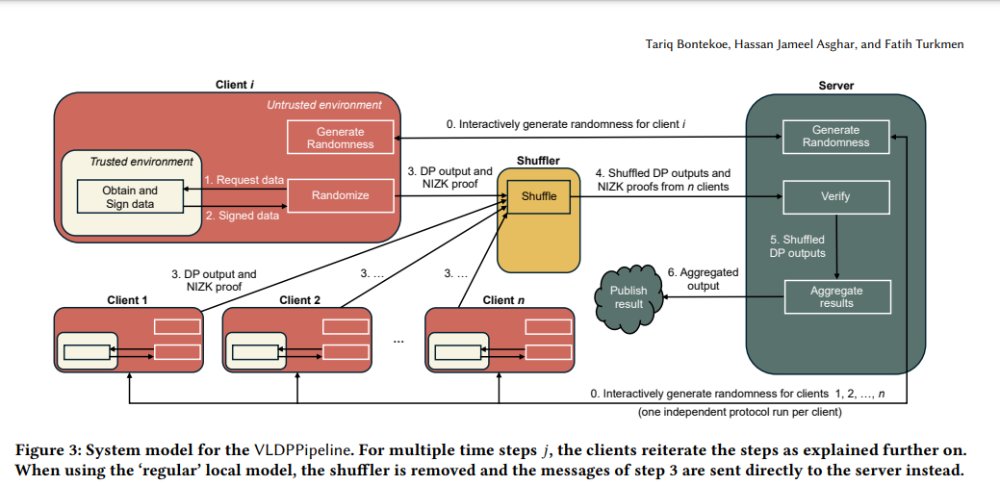

---

## 登場人物と役割

* **クライアント（Client）**

  * 信頼できる環境（Secure Enclave等）で「生データを取得→署名」
  * それを使って「差分プライバシー化＋証明生成」を行い、結果を送信

* **シャッフラー（Shuffler）**

  * クライアントから受け取ったデータをバラバラに並べ替え、匿名化してサーバーへ中継

* **サーバー（Server）**

  * 受け取った出力と証明をチェック
  * 問題なければ統計を集計・公開

---

## 処理の流れ（全６ステップ）

1. **乱数の生成 (0)**

   * クライアントとサーバーで安全に使うランダム値を協調生成

2. **データの署名 (1→2)**

   * 信頼環境で生データ x を秘密鍵でサイン → (x, σₓ)

3. **差分プライバシー化＋証明 (2)**

   * (x, σₓ) と乱数 ρ を使い、プライバシー化した値 ẋ とゼロ知識証明 π を作成

4. **送信 (3)**

   * (ẋ, π) をシャッフラーへ送る
   * ※ローカルモデルでは直接サーバーへ

5. **並べ替え (4→5)**

   * シャッフラーで n 件の (ẋ, π) をシャッフルしてサーバーに中継

6. **検証・集計 (5→6)**

   * サーバーが π の正当性を検証 → 問題なければ ẋ を受理
   * 最後に全件を集計して結果を公開

---

### 「ローカルモデル」と「シャッフルモデル」の違い

* **ローカルモデル**

  * ステップ4（シャッフル）を省略し、直接サーバーへ送信
* **シャッフルモデル**

  * ステップ4 でデータを混ぜることで、誰のデータか分からないようにする

---

