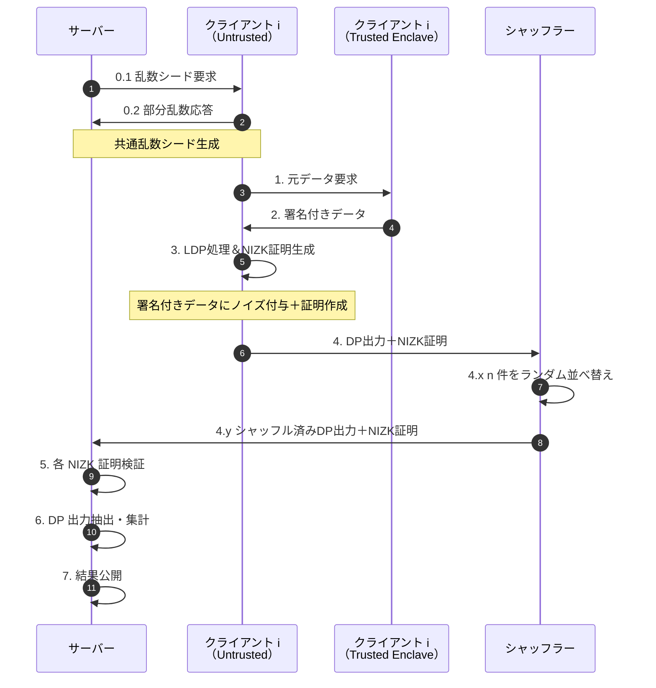

シーケンス図で、VLDPPipeline の主要フロー

---

### 各ステップ対応

1. **ステップ0（乱数相互生成）**
   サーバーとクライアントがそれぞれ部分的な乱数をやり取りし、共通の乱数シードを安全に確定。

2. **ステップ1→2（署名付きデータ取得）**
   Trusted Enclave が元データを読み取り、秘密鍵で署名。アン・トラストド環境はその署名付きデータのみ受領。

3. **ステップ3（LDP＋NIZK証明生成）**
   アン・トラストド環境でローカル差分プライバシー処理（ノイズ付与）を行い、非対話型ゼロ知識証明を同時生成。

4. **ステップ4（シャッフル）**
   各クライアントから送られた DP 出力と証明をシャッフラーがランダムに並べ替え、順序の匿名化を強化。

5. **ステップ5（証明検証）**
   サーバー側で NIZK 証明を検証し、不正なものは排除。

6. **ステップ6→7（集計・公開）**
   検証済みの DP 出力を集計し、最終的な統計結果を公開。

