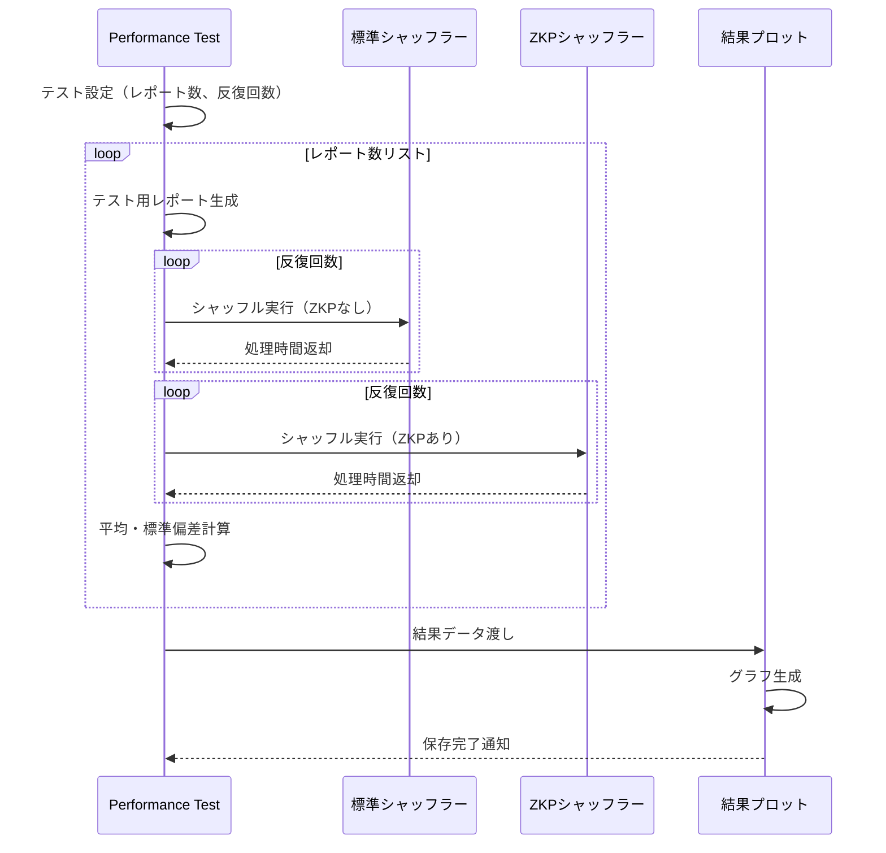
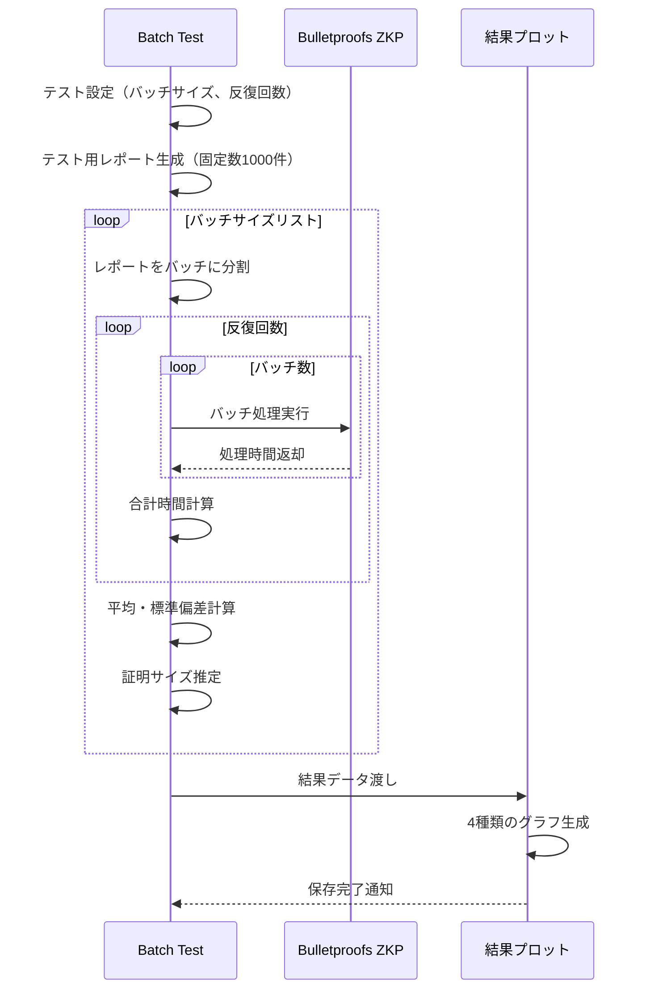
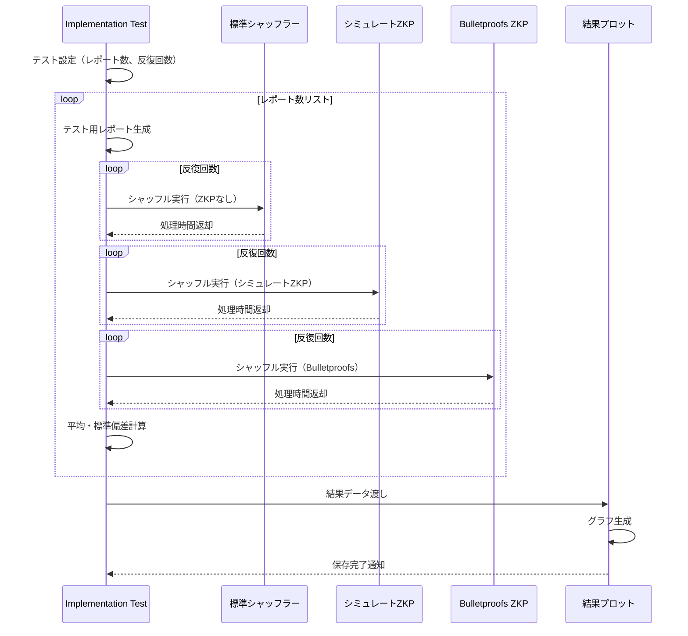

# RAPPORにおけるZKP性能テストの実施方法

## テスト環境の準備

1. **環境セットアップ**
   ```bash
   pip install matplotlib numpy cryptography
   ```

2. **プロジェクト構造の確認**
   ```
   rappor_project/
   ├── client.py
   ├── server.py
   ├── shuffler.py
   ├── verifiable_shuffler.py
   ├── performance_test.py        # ZKPあり/なしの比較
   ├── bulletproofs_batch_test.py # バッチサイズ効果の比較
   └── _results/                  # 結果の保存先
   ```

## テスト実行手順

### 1. ZKPありとなしの性能比較テスト

```bash
python performance_test.py
```

このテストでは以下を実行します：
- 異なるレポート数（10, 50, 100, 250, 500, 1000）でのZKPありとなしの処理時間比較
- 各設定での複数回の反復実行
- 平均処理時間とオーバーヘッド比率の計算
- 結果のグラフとJSONファイルの生成

### 2. Bulletproofsのバッチサイズ効果テスト

```bash
python bulletproofs_batch_test.py
```

このテストでは以下を実行します：
- 異なるバッチサイズ（1, 2, 4, 8, 16, 32, 64, 128, 256）での処理時間測定
- 各バッチサイズでの複数回の反復実行
- 合計処理時間、証明あたりの時間、証明サイズの計算
- 4種類のグラフと結果JSONファイルの生成

### 3. テスト結果の確認

```bash
cd _results
ls -la
```

以下のファイルが生成されます：
- `zkp_performance_comparison.png/.pdf`: ZKPありとなしの比較グラフ
- `bulletproofs_batch_comparison.png/.pdf`: バッチサイズ効果のグラフ
- `zkp_performance_results.json`: ZKP比較の数値データ
- `bulletproofs_batch_results.json`: バッチテストの数値データ

## テスト処理フロー（シーケンス図）

### ZKPありとなしの比較テスト



### Bulletproofsのバッチサイズ効果テスト



### シミュレートZKPとBulletproofsの比較テスト



